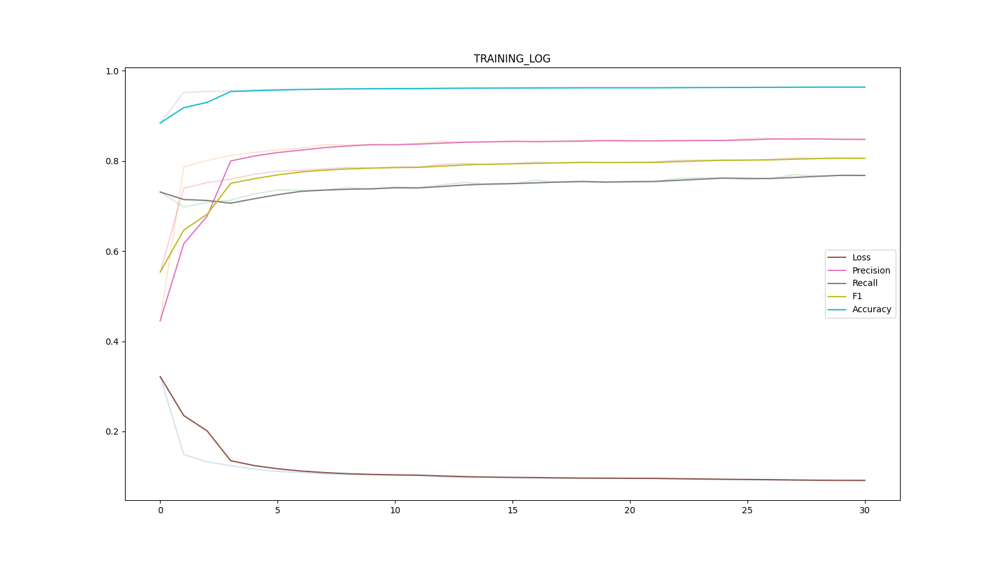
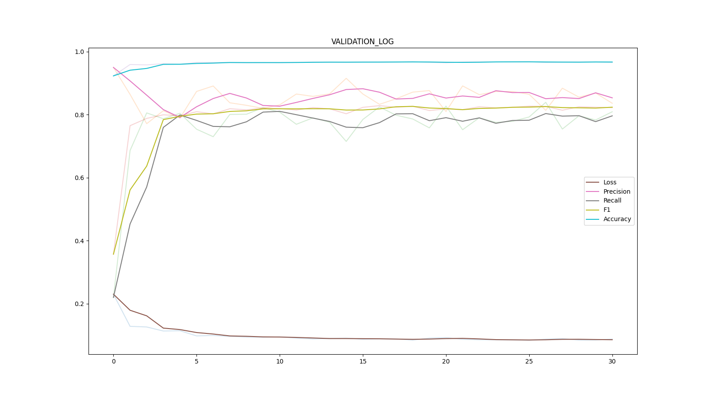

### This example consist of retinal blood vessel segmentation on two datasets- DRIVE<sub>[1]</sub>, and STARE<sub>[2]</sub> using  [easytorch](https://github.com/sraashis/easytorch) frameowork.

- **Install pytorch and torchvision from [official website](https://pytorch.org/)**
- **pip install easytorch**
1. Initialize the **dataspecs.py** as follows. Non existing directories will be automatically created in the first run.
```python
import os

sep = os.sep
DRIVE = {
    'name': 'DRIVE',
    'data_dir': 'DRIVE' + sep + 'images',
    'label_dir': 'DRIVE' + sep + 'manual',
    'label_getter': lambda file_name: file_name.split('_')[0] + '_manual1.gif',
    'mask_getter': lambda file_name: file_name.split('_')[0] + '_mask.gif'
}
STARE = {
    'name': 'STARE',
    'data_dir': 'STARE' + sep + 'stare-images',
    'label_dir': 'STARE' + sep + 'labels-ah',
    'label_getter': lambda file_name: file_name.split('.')[0] + '.ah.pgm',
}

```
* **name** Unique name for each specification used.
* **data_dir** is the path to images/or any data points.
* **label_dir** is the path to ground truth.
* **label_getter** is a function that gets corresponding ground truth of an image/data-point from **label_dir**.
* **mask_getter** is a function that gets corresponding mask of an image/data-point from **mask_dir**.

### Define how to load each image files to feed to the U-Net.
```python
import os
import random

import numpy as np
import torchvision.transforms as tmf
from easytorch import ETDataset
from easytorch.vision import (Image, get_chunk_indexes, expand_and_mirror_patch)
sep = os.sep

class MyDataset(ETDataset):
    def __init__(self, **kw):
        r"""
        Initialize necessary shapes for unet.
        """
        super().__init__(**kw)
        self.patch_shape = (388, 388)
        self.patch_offset = (200, 200)
        self.input_shape = (572, 572)
        self.expand_by = (184, 184)
        self.image_objs = {}

    def load_index(self, dataset_name, file):
        r"""
        :param dataset_name: name of teh dataset as provided in dataspecs
        :param file: Name of an image
        :return:
        Logic split an image to patches and feed to U-Net. Meancwhile we need to store the four-corners
            of each patch so that we can rejoin the full image from the patches' corresponding predictions.
        """
        dt = self.dataspecs[dataset_name]
        img_obj = Image()
        img_obj.load(dt['data_dir'], file)
        img_obj.load_ground_truth(dt['label_dir'], dt['label_getter'])
        img_obj.apply_clahe()
        img_obj.array = img_obj.array[:, :, 1]
        self.image_objs[file] = img_obj
        for corners in get_chunk_indexes(img_obj.array.shape, self.patch_shape, self.patch_offset):
            """
            get_chunk_indexes will return the list of four corners of all patches of the images  
            by using window size of self.patch_shape, and offset  of elf.patch_offset
            """
            self.indices.append([dataset_name, file] + corners)

    def __getitem__(self, index):
        """
        :param index:
        :return: dict with keys - indices, input, label
            We need indices to get the file name to save the respective predictions.
        """
        map_id, file, row_from, row_to, col_from, col_to = self.indices[index]

        img = self.image_objs[file].array
        gt = self.image_objs[file].ground_truth[row_from:row_to, col_from:col_to]

        p, q, r, s, pad = expand_and_mirror_patch(img.shape, [row_from, row_to, col_from, col_to], self.expand_by)
        img = np.pad(img[p:q, r:s], pad, 'reflect')

        if self.mode == 'train' and random.uniform(0, 1) <= 0.5:
            img = np.flip(img, 0)
            gt = np.flip(gt, 0)

        if self.mode == 'train' and random.uniform(0, 1) <= 0.5:
            img = np.flip(img, 1)
            gt = np.flip(gt, 1)

        img = self.transforms(img)
        gt = self.transforms(gt)
        return {'indices': self.indices[index], 'input': img, 'label': gt.squeeze()}

    @property
    def transforms(self):
        return tmf.Compose(
            [tmf.ToPILImage(), tmf.ToTensor()])

```
### Define iteration and how to save predicted images.
```python
from easytorch import ETTrainer
from models import UNet
import torch
import torch.nn.functional as F
from easytorch.vision import  merge_patches
import numpy as np
import os
from PIL import Image as IMG
sep = os.sep
class MyTrainer(ETTrainer):
    def __init__(self, args):
        super().__init__(args)

    def _init_nn_model(self):
        self.nn['model'] = UNet(self.args['num_channel'], self.args['num_class'], reduce_by=self.args['model_scale'])

    def iteration(self, batch):
        r"""
        :param batch:
        :return: dict with keys - loss(computation graph), averages, output, metrics, predictions
        """
        inputs = batch['input'].to(self.device['gpu']).float()
        labels = batch['label'].to(self.device['gpu']).long()

        out = self.nn['model'](inputs)
        loss = F.cross_entropy(out, labels)
        out = F.softmax(out, 1)

        _, pred = torch.max(out, 1)
        sc = self.new_metrics()
        sc.add(pred, labels)

        avg = self.new_averages()
        avg.add(loss.item(), len(inputs))

        return {'loss': loss, 'averages': avg, 'output': out, 'metrics': sc, 'predictions': pred}

    def save_predictions(self, dataset, its):
        """load_sparse option in default params loads patches of single image in one dataloader.
         This enables to merge them safely to form the whole image """
        dataset_name = list(dataset.dataspecs.keys())[0]
        file = list(dataset.image_objs.values())[0].file
        img_shape = dataset.image_objs[file].array.shape

        """
        Loop over and gather all the predicted patches of one image and merge together"""
        patches = []
        for it in its:
            patches.append(it["output"][:, 1, :, :])

        patches = torch.cat(patches, 0).cpu().numpy() * 255
        patches = patches.astype(np.uint8)
        img = merge_patches(patches, img_shape, dataset.patch_shape, dataset.patch_offset)
        IMG.fromarray(img).save(self.cache['log_dir'] + sep + dataset_name + '_' + file + '.png')


```
### Entry point
```python
import argparse
from easytorch.etargs import ap

from easytorch import EasyTorch
from classification import MyTrainer, MyDataset
runner = EasyTorch([DRIVE, STARE],
                   phase='train', batch_size=4, epochs=21,
                   load_sparse=True, num_channel=1, num_class=2,
                   model_scale=16, dataset_dir='datasets')
if __name__ == "__main__":
    runner.run(MyDataset, MyTrainer)
    runner.run_pooled(MyDataset, MyTrainer)


```

### Results for DRIVE, STARE and pooled are in net_logs folder
* It should be trained more epochs to gets state of the art result. 

### Dataset pooling
It is an useful feature that can combine datasets without moving the datasets from their original locations, and feed to the network as if we are training on one large dataset. In this example, we have ran the following experiments:
* Train one model on DRIVE dataset with single train, validation, and test split.
* Train 5-models on STARE datasets with 5-fold split(5 fold cross-validation).
* Train one model by pooling both DRIVE and STARE Datasets without moving data from the original location.

### Generated plots:
1. DRIVE dataset logs example.
    * Training log
        
    * Validation log
        
      
### Test Scores
|Fold|Precision|Recall|F1|Accuracy|
|------------|-------|-------|-------|-------|
|SPLIT_2.json|0.8481 |0.80524|0.82611|0.96693|
|SPLIT_8.json|0.83081|0.76595|0.79706|0.96111|
|SPLIT_7.json|0.79472|0.81938|0.80686|0.96407|
|SPLIT_6.json|0.8464 |0.7572 |0.79932|0.96361|
|SPLIT_9.json|0.82199|0.80759|0.81473|0.96407|
|SPLIT_4.json|0.79218|0.75019|0.77061|0.95209|
|SPLIT_5.json|0.81362|0.80151|0.80752|0.96163|
|SPLIT_0.json|0.81717|0.78315|0.7998 |0.96122|
|SPLIT_1.json|0.80873|0.79497|0.80179|0.96063|
|SPLIT_3.json|0.8135 |0.78912|0.80112|0.96301|
|Global      |0.81813|0.78694|0.80223|0.96184|

**``
Please note that one MUST cite the original authors if these dataset are used in your research (references at the end)
``**

## References
1. DRIVE Dataset, J. Staal, M. Abramoff, M. Niemeijer, M. Viergever, and B. van Ginneken, “Ridge based vessel segmentation in color images of the retina,” IEEE Transactions on Medical Imaging 23, 501–509 (2004)
2. STARE Dataset, A. D. Hoover, V. Kouznetsova, and M. Goldbaum, “Locating blood vessels in retinal images by piecewise threshold
       probing of a matched filter response,” IEEE Transactions on Med. Imaging 19, 203–210 (2000)
3. Architecture used, O. Ronneberger, P. Fischer, and T. Brox, “U-net: Convolutional networks for biomedical image segmentation,” in
    MICCAI, (2015)
4. Our paper on vessel segmentation:
    * [Link to arxiv](https://arxiv.org/abs/1903.07803)
    * [Dynamic Deep Networks for Retinal Vessel Segmentation](https://www.frontiersin.org/articles/10.3389/fcomp.2020.00035/abstract)
